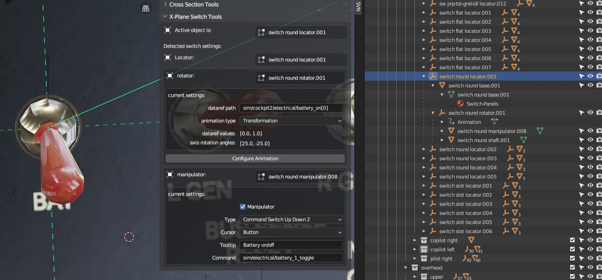

Tooling to manage X-Plane switch heirarchies in Blender models.

Tooling appears in the 3d view in the item panel.

This relies on the naming of the objects in the heirachy. 
At the root it expects to find an object with a name containg the text 'locator' 
at some point below that in the heirachy it expects an object with a name containg 'rotator' 
This will be the object which contains the rotational animation. 
And again below the locator it expects to find an element with 'manipulator' in the name. This
will be the object that gets the manipulator type and command parameters.

If the rotator does not contain an animation it can be added and modified using the associated 
operator, this will generate 'n' animated steps with angles between min and max and associated 
dataref values between min and max (set using properties on the redo panel)

***Warning:*** Using the animation configuration operation will clear any current animation 
associated with the rotator object!

Other properties are set directly using the tool panel.